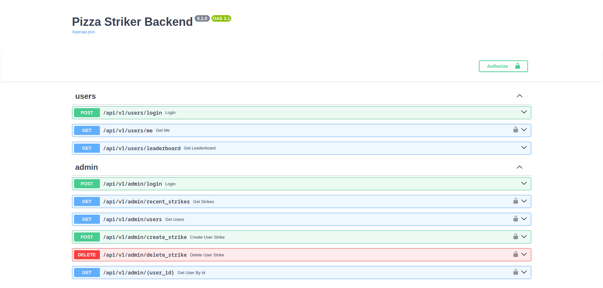

<h1 align="center" id="title">Pizza Striker Backend Project</h1>

Welcome to my Fun Project! 🌟 (Pizza Striker). This project is built with FastAPI, Sqlalchemy and Postgresql. The aim is to provide an backend support to out Admin Dashboard featuring JWT Authentication, Data Validating etc.

<h2>Swagger UI </h2>

 <h2>Features</h2>

Here are some of the project's best features:

- **Data Validation with Pydantic:** Ensure data integrity and reliability using Pydantic for validation.

- **PostgreSQL Database:** Utilize PostgreSQL for efficient data storage and management.

- **Enhanced Authentication:** Implement JWT for secure user authentication and authorization.

<h2>Built with</h2>

Technologies used in the project:

- [Python](https://www.python.org/)
- [PostgreSQL](https://www.postgresql.org/)
- [SQLAlchemy](https://www.sqlalchemy.org/)
- [FastAPI](https://fastapi.tiangolo.com/)

<h2>Project Repository</h2>

- [Backend Repository](https://github.com/Saurabh254/pizza_striker-backend)
- [Frontend Repository](https://github.com/Saurabh254/pizza_striker_admin)
